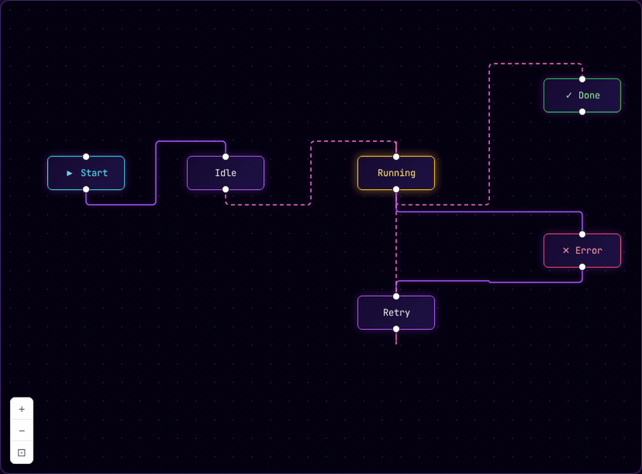

<p align="center">
  
</p>

<h1 align="center">gea-flow</h1>

<p align="center">
  React Flow-style node editor for the <a href="https://geajs.com">Gea</a> framework.
</p>

<p align="center">
  <a href="https://www.npmjs.com/package/@gea-flow/core"></a>
  <a href="https://github.com/tutkuucan/gea-flow/blob/main/LICENSE"></a>
</p>

---

<p align="center">
  
</p>

<p align="center">
  <em>Animated edges, custom node states, smooth transitions — see more on the <a href="https://gea-flow.com/examples">examples page</a>.</em>
</p>

---

`gea-flow` is a node editor library for [Gea](https://geajs.com) built as a thin adapter on top of [`@xyflow/system`](https://github.com/xyflow/xyflow) — the framework-agnostic core that powers React Flow and Svelte Flow. It gives you draggable nodes, connectable handles, pan/zoom, selection, a minimap, and customizable rendering, while staying fully reactive with Gea's compile-time bindings.

For complete documentation, examples, and API reference, visit **[gea-flow.com/docs](https://gea-flow.com/docs)**.

## Features

- Drag, pan, zoom, pinch, and scroll out of the box
- Click, shift-click, and lasso (shift-drag) selection
- Connectable handles with edge creation by drag
- Built-in edge types: `bezier`, `straight`, `step`, `smoothstep`
- Custom node and edge components written as plain Gea components
- Built-in `Background`, `Controls`, and `MiniMap`
- Reactive `FlowStore` — mutate state, the canvas updates
- Flat callback API: `onConnect`, `onNodesChange`, `onEdgesChange`, `onSelectionChange`
- Keyboard shortcuts: `Delete` / `Backspace` to remove, `Cmd/Ctrl+A` to select all
- Tiny, dependency-light, fully typed

## Installation

```bash
npm install @gea-flow/core @geajs/core
```

`@geajs/core` is a peer dependency. If you scaffold a new Gea app, you also need `@geajs/vite-plugin`:

```bash
npm install -D @geajs/vite-plugin
```

### Vite configuration

Because of how Gea's compiler runtime resolves modules, exclude its packages from Vite's prebundling step:

```ts
// vite.config.ts
import { defineConfig } from 'vite'
import { geaPlugin } from '@geajs/vite-plugin'

export default defineConfig({
  plugins: [geaPlugin()],
  optimizeDeps: {
    exclude: ['@geajs/core', '@geajs/core/compiler-runtime', '@gea-flow/core'],
  },
})
```

## Quick start

Drop a flow into your app with a few nodes and edges. Don't forget to import the stylesheet.

```tsx
import { Component } from '@geajs/core'
import { GeaFlow, Background, Controls } from '@gea-flow/core'
import '@gea-flow/core/styles.css'

const nodes = [
  { id: 'a', position: { x: 80, y: 60 }, data: { label: 'Welcome' } },
  { id: 'b', position: { x: 80, y: 200 }, data: { label: 'Sign Up' } },
  { id: 'c', position: { x: 320, y: 130 }, data: { label: 'Verify Email' } },
]

const edges = [
  { id: 'eab', source: 'a', target: 'b' },
  { id: 'ebc', source: 'b', target: 'c' },
]

export default class App extends Component {
  template() {
    return (
      <div style={{ width: '100vw', height: '100vh' }}>
        <GeaFlow nodes={nodes} edges={edges}>
          <Background variant="dots" />
          <Controls />
        </GeaFlow>
      </div>
    )
  }
}
```

The container needs an explicit width and height — `<GeaFlow>` fills its parent.

## Two ways to drive the flow

### Easy mode — pass arrays as props

Best for static or small flows. `<GeaFlow>` creates an internal store for you.

```tsx
<GeaFlow nodes={nodes} edges={edges} onNodesChange={(n) => console.log(n)} />
```

### Power mode — bring your own store

When you want to mutate from outside the flow (toolbars, side panels, async events), create a store and pass it in.

```tsx
import { createFlowStore, GeaFlow } from '@gea-flow/core'

export const flow = createFlowStore({
  nodes: [/* ... */],
  edges: [/* ... */],
})

// Anywhere in your app:
flow.addNodes([{ id: 'x', position: { x: 0, y: 0 }, data: { label: 'New' } }])
flow.fitView({ padding: 0.2 })

// In your template:
<GeaFlow store={flow}>
  <Background />
  <Controls />
</GeaFlow>
```

Because the store is a plain class (not a Gea `Store`), you can safely keep it as a property of any other component or `Store` without losing reactivity.

## Custom node types

A custom node is just a Gea component (function or class) that receives `NodeProps`.

```tsx
import { Handle, Position, type NodeProps } from '@gea-flow/core'

interface StatusData extends Record<string, unknown> {
  title: string
  status: 'idle' | 'running' | 'done' | 'error'
}

export function StatusNode({ data, selected }: NodeProps<StatusData>) {
  return (
    <div class={`status-node status-node--${data.status} ${selected ? 'selected' : ''}`}>
      <Handle type="target" position={Position.Top} />
      <strong>{data.title}</strong>
      <Handle type="source" position={Position.Bottom} />
    </div>
  )
}

const nodeTypes = { status: StatusNode }

<GeaFlow nodes={nodes} edges={edges} nodeTypes={nodeTypes} />
```

A node uses your custom renderer when its `type` matches a key in `nodeTypes`. The same pattern applies to `edgeTypes`.

## Components

| Component        | Purpose                                                          |
| ---------------- | ---------------------------------------------------------------- |
| `<GeaFlow>`      | Root container. Owns viewport, pan/zoom, selection, drag.        |
| `<Background>`   | Dot, cross, or line grid that follows the viewport.              |
| `<Controls>`     | Zoom in / zoom out / fit-view buttons.                           |
| `<MiniMap>`      | Overview map with viewport indicator.                            |
| `<Handle>`       | Connection point on a node — used inside custom node components. |

`<Background>`, `<Controls>`, and `<MiniMap>` must be placed as children of `<GeaFlow>`.

## `<GeaFlow>` props

| Prop                | Type                                              | Description                                              |
| ------------------- | ------------------------------------------------- | -------------------------------------------------------- |
| `store`             | `FlowStore`                                       | Power mode: external store you control.                  |
| `nodes`             | `GeaNode[]`                                       | Easy mode: initial nodes.                                |
| `edges`             | `GeaEdge[]`                                       | Easy mode: initial edges.                                |
| `nodeTypes`         | `Record<string, NodeComponent>`                   | Custom node renderers, keyed by `node.type`.             |
| `edgeTypes`         | `Record<string, EdgeComponent>`                   | Custom edge renderers, keyed by `edge.type`.             |
| `minZoom`           | `number`                                          | Default `0.5`.                                           |
| `maxZoom`           | `number`                                          | Default `2`.                                             |
| `defaultViewport`   | `{ x; y; zoom }`                                  | Initial viewport transform.                              |
| `onInit`            | `(store) => void`                                 | Fires once after mount with the resolved store.          |
| `onConnect`         | `(connection) => void`                            | Fires when the user drags a new edge between handles.    |
| `onNodesChange`     | `(nodes) => void`                                 | Fires whenever the nodes array mutates.                  |
| `onEdgesChange`     | `(edges) => void`                                 | Fires whenever the edges array mutates.                  |
| `onSelectionChange` | `({ nodes, edges }) => void`                      | Fires whenever the selection changes.                    |

## `FlowStore` API

The store is the source of truth for everything on the canvas. A summary of the most useful members:

```ts
const flow = createFlowStore({ nodes, edges })

// Reactive state (read or assign)
flow.nodes
flow.edges
flow.transform          // [x, y, zoom]

// Node and edge mutations
flow.setNodes(nodes)
flow.addNodes(nodes)
flow.setEdges(edges)
flow.addEdges(edges)
flow.updateNodePosition(id, { x, y })
flow.findNode(id)

// Selection
flow.selectNode(id, { multi: true })
flow.selectEdge(id)
flow.selectAllNodes()
flow.clearSelection()
flow.deleteSelected()

// Connections
flow.connect({ source, target })

// Viewport
flow.zoomIn()
flow.zoomOut()
flow.setViewport({ x, y, zoom })
flow.fitView({ padding: 0.1 })
```

Mutating any reactive field (e.g. `flow.nodes = [...]`) updates the canvas automatically. No manual re-render call needed.

## Built-in edge types

Set `edge.type` to one of the following, or omit it to use `bezier`:

- `bezier` (default)
- `straight`
- `step`
- `smoothstep`

```ts
const edges = [
  { id: 'e1', source: 'a', target: 'b' },                    // bezier
  { id: 'e2', source: 'b', target: 'c', type: 'smoothstep' },
  { id: 'e3', source: 'c', target: 'd', type: 'step', animated: true, label: 'next' },
]
```

## Keyboard and pointer interactions

| Action                     | Result                                  |
| -------------------------- | --------------------------------------- |
| Click node or edge         | Select                                  |
| Shift-click                | Toggle in multi-selection               |
| Shift-drag on empty canvas | Lasso selection                         |
| Drag node                  | Move (mutates `node.position`)          |
| Drag from handle           | Create a new edge                       |
| Scroll / pinch             | Zoom                                    |
| Drag empty canvas          | Pan                                     |
| `Delete` / `Backspace`     | Remove selected nodes and edges         |
| `Cmd/Ctrl + A`             | Select all nodes                        |

## Styling

Import the default stylesheet once at your app entry:

```ts
import '@gea-flow/core/styles.css'
```

Every element exposes `gea-flow__*` class names so you can override styles freely. Selected nodes and edges receive a `.selected` class.

## Repository layout

```
gea-flow/
├── packages/
│   ├── core/        @gea-flow/core — the published library
│   ├── examples/    Live dev playground
│   └── website/     Documentation site (gea-flow.com)
└── scripts/         Smoke tests
```

## Development

```bash
git clone https://github.com/tutkuucan/gea-flow.git
cd gea-flow
npm install
npm run dev          # examples on http://localhost:5173
npm run build        # build the core package
npm run typecheck    # type-check all packages
```

## Documentation

Full guides, tutorials, and the complete API reference live at **[gea-flow.com/docs](https://gea-flow.com/docs)**.

## License

[MIT](LICENSE) — built on top of [`@xyflow/system`](https://github.com/xyflow/xyflow), also MIT.
